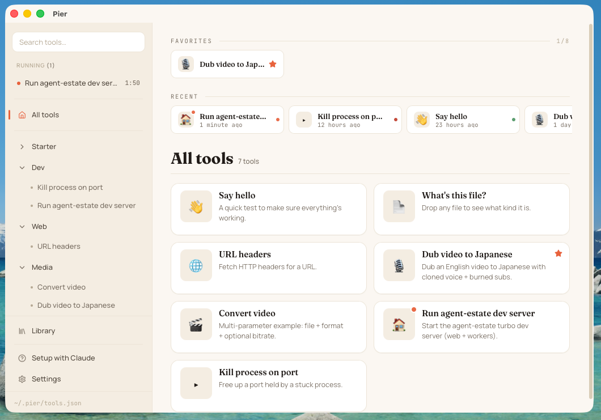
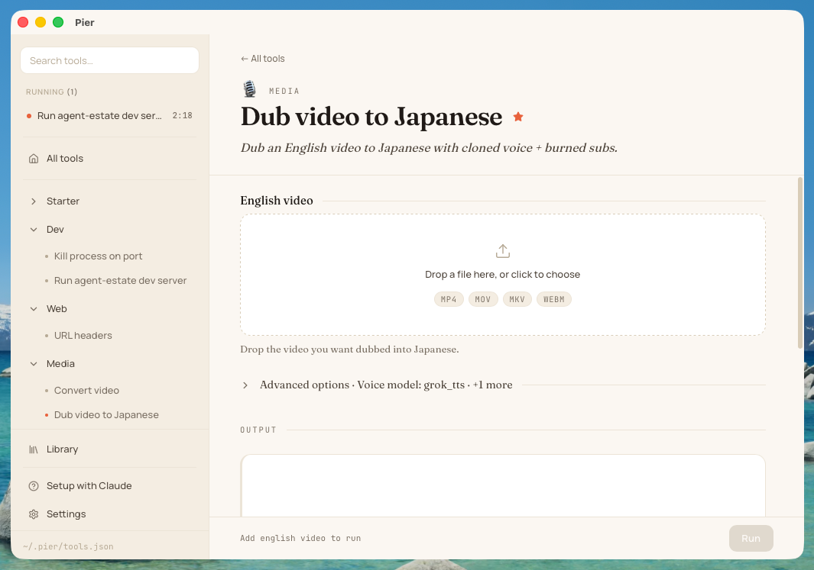
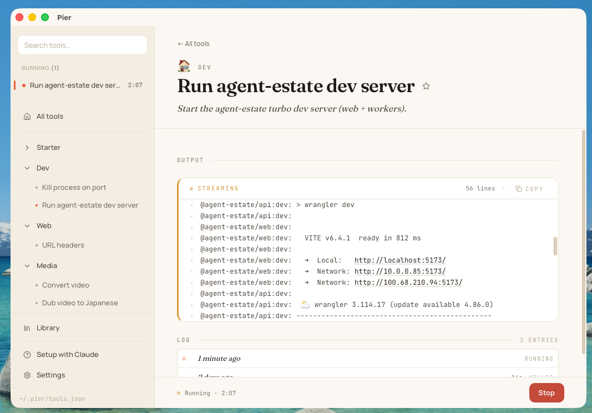

<div align="center">


# Pier

**Drag-drop launcher for the CLI tools you and Claude Code build together.**

[](https://github.com/KenTaniguchi-R/pier/releases/latest)
[](https://github.com/KenTaniguchi-R/pier/releases)
[](LICENSE)
[](#install)



</div>

---

## Why Pier

You ask Claude Code to write a quick CLI tool — transcribe a video, rename a folder of photos, dub a clip into Japanese. It works. Then it lives in `~/scripts/` and you forget the flags by Tuesday.

Pier turns those scripts into **tiles in your menu bar**. Click a tile, fill in its inputs (drop a file, pick a folder, type a value), hit Run. Output streams back live.

The whole catalog is one JSON file (`~/.pier/tools.json`) — so **Claude Code adds, edits, and removes tools by talking to the file directly**. No UI work, no per-tool scripting, no electron-app-per-task graveyard.

## Install

Grab the latest **`Pier_x.y.z_universal.dmg`** from [Releases](https://github.com/KenTaniguchi-R/pier/releases/latest), drag **Pier.app** to **Applications**, launch.

Builds are codesigned (Developer ID: Benri LLC) and notarized by Apple — no Gatekeeper warnings. Future updates download silently and prompt to install on quit.

## 60-second tour

**1. Define a tool** — ask Claude Code, or edit `~/.pier/tools.json` directly:

```json
{
  "id": "transcribe",
  "name": "Transcribe",
  "icon": "▸",
  "command": "/usr/local/bin/whisper",
  "args": ["{input}", "--model", "{model}"],
  "parameters": [
    { "id": "input", "type": "file", "accepts": [".mp4", ".m4a", ".mp3"] },
    { "id": "model", "type": "select", "options": ["tiny", "base", "small"], "default": "base" }
  ]
}
```

**2. Pier hot-reloads** within a second. A new tile appears.

**3. Click the tile** to open its run dialog. Drop a file into the input zone, fill any other parameters, hit Run.

<div align="center">

</div>

**4. Watch stdout stream in live.** Stop, re-run, or open past runs from the History panel.

<div align="center">

</div>

Every run is appended to `~/.pier/audit.log` (JSONL) for forensics.

## Working with Claude Code

Pier ships a [bundled skill](docs/skill.md) so Claude Code knows the schema and the `~/.pier/tools.json` location. Drop it in once and ask things like:

> *"Add a tool that resizes any image I drop on it to 1080p, using the ffmpeg in `/opt/homebrew/bin`."*

Claude writes the JSON entry, Pier hot-reloads, the tile is live.

## Features

- **One-tile-per-tool** for any CLI binary or script, with file/folder drag-drop on input fields
- **Typed parameters** — `file`, `folder`, `text`, `url`, `select`, `boolean`, `number`, `multiselect`, `slider`, `date`
- **Hot-reloading config** — edit JSON, tiles update in place
- **Categories, favorites, recents, and search** — stay fast as the catalog grows
- **Long-running processes** with live streaming output and a Stop button (dev servers, watchers, etc.)
- **Secrets, done right** — `${keychain:NAME}` pulls from macOS Keychain; audit log records *which* vars came from where, never the values
- **Run history** — re-open past output blobs from `~/.pier/runs/`
- **Library** — one-click install curated tools from [pier-tools](https://github.com/KenTaniguchi-R/pier-tools)
- **Auto-update** with minisign-verified bundles
- **Launch at login** via `SMAppService`
- **Menu-bar native** — true tray app, signed + notarized

## Build from source

```bash
git clone https://github.com/KenTaniguchi-R/pier
cd pier
npm install
npm run tauri:dev      # run the app
npm run tauri build    # produce a local DMG
```

Output: `src-tauri/target/release/bundle/dmg/Pier_*.dmg`. See [`CLAUDE.md`](CLAUDE.md) for the architecture map.

## More

<details>
<summary><b>Full <code>tools.json</code> schema</b></summary>

```json
{
  "id": "kebab-case-id",
  "name": "Display Name",
  "command": "/absolute/path/to/binary",
  "args": ["{input}"],
  "parameters": [
    { "id": "input", "type": "file", "accepts": [".mp4"] }
  ],
  "cwd": "/path/to/project",
  "envFile": ".env",
  "env": { "DEBUG": "1", "API_KEY": "${keychain:my-key}" },
  "description": "One line",
  "icon": "▸",
  "confirm": false,
  "category": "media"
}
```

Args reference parameters with `{paramId}`. `cwd` sets the working directory; `envFile` loads a `.env` relative to `cwd`; `env` supports `${keychain:NAME}` and `${env:NAME}` interpolation. See [`examples/tools.json`](examples/tools.json).

</details>

<details>
<summary><b>Architecture</b></summary>

Tauri 2 + React 19 + TypeScript. Clean architecture on both sides:

- **Frontend**: `domain/` → `application/` → `infrastructure/` → `ui/` (atomic) + `state/` (Context + reducer)
- **Backend**: `domain/` → `application/` → `infrastructure/` + thin `commands.rs`

Full map in [`CLAUDE.md`](CLAUDE.md).

</details>

## Status

v0.x, actively developed. macOS only for now (Linux/Windows on the table once the macOS UX settles).

## License

MIT
